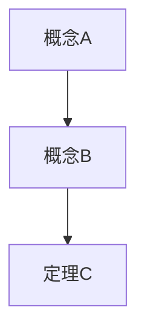

# Write Course Notes

## Daily-review mode

When invoked by `daily-course-review.md`, use its saved preparation-note setting
and exact new/substantively changed lecture list. Skip the interactive selection
and detailed-note pipeline below; existing authorization supplies the scope.
If notes are disabled, generate none. Default to brief Chinese preparation notes
under the existing `notes/` directory: a short overview, core ideas/examples,
pitfalls, 2–5 self-check questions and source pages. Support readable lecture
PDF/PPTX/DOCX sources using appropriate extraction/rendering tools; do not claim
coverage of unreadable slides. No lecture material means skip notes, not stop
the course review. Metadata-only changes do not regenerate notes.

Preserve personal annotations and existing detailed notes. Update only clearly
identified generated preview content; otherwise add a linked update beside the
existing note. Maintain `notes/README.md` without replacing unrelated entries.
Any delegated readers return evidence/drafts; the main agent owns final writes
to notes and shared indexes. This mode takes precedence over the per-run
questions, per-PDF writer assignments and blanket no-overwrite rule below.

## Manual full-note mode

Fixed-pipeline note generation from archived lecture PDFs. Uses a parallel
Agent Team — one Agent per lecture PDF — to produce structured, Obsidian-style
Markdown notes.

**Prerequisite**: `data/courses/<COURSE>/materials/lectures/` must contain PDFs
from a prior `sync-course` run. If empty, tell the user to run sync-course first.

**Reference**: Modeled after AutoPku's `write-notes` task skill.

## Execution flow (4 fixed steps)

### Step 1: Discover lectures

```bash
COURSE_DIR="data/courses/<COURSE>"
LECTURES_DIR="$COURSE_DIR/materials/lectures"

# List PDFs sorted by name
ls "$LECTURES_DIR"/*.pdf 2>/dev/null | sort || echo "NO_PDFS"
```

If `NO_PDFS`:
- Tell user: "这门课还没有同步课件资料。请先运行 sync-course 下载课件。"
- Stop.

If PDFs found, display the list with indices:
```
发现 X 个课件:
  1. L01-introduction.pdf (23 pages)
  2. L02-linear-algebra.pdf (31 pages)
  ...
```

### Step 2: User confirmation (AskUserQuestion — 3 questions)

```
AskUserQuestion({
    "questions": [
        {
            "question": "选择要撰写笔记的课件：",
            "options": [
                {"label": "全部课件", "value": "all"},
                {"label": "指定范围", "value": "range"}
            ],
            "multiSelect": false
        },
        {
            "question": "笔记详细程度：",
            "options": [
                {"label": "精简（只保留核心定义和定理）", "value": "minimal"},
                {"label": "标准（包含证明思路）", "value": "standard"},
                {"label": "详细（完整推导过程）", "value": "detailed"}
            ],
            "multiSelect": false
        },
        {
            "question": "额外要求（多选）：",
            "options": [
                {"label": "添加LaTeX公式编号", "value": "numbered_eq"},
                {"label": "添加概念之间的关联图", "value": "concept_map"},
                {"label": "添加例题（如有）", "value": "examples"}
            ],
            "multiSelect": true
        }
    ]
})
```

If "指定范围": ask which indices (e.g., "1, 3-5").

### Step 3: Parallel Agent Team — one Writer Agent per PDF

For each selected PDF, spawn a Writer Agent using Claude Code `Agent()`:

```python
agent_configs = []
for pdf_path in selected_pdfs:
    lecture_name = Path(pdf_path).stem  # e.g., "L01-introduction"
    agent_configs.append({
        "name": f"note-writer-{lecture_name}",
        "prompt": WRITER_AGENT_PROMPT.format(
            pdf_path=pdf_path,
            notes_dir=f"{COURSE_DIR}/notes",
            lecture_name=lecture_name,
            detail_level=detail_level,
            extra_options=extra_options
        ),
        "description": f"撰写 {lecture_name} 的课程笔记"
    })

# Spawn all agents in parallel (Claude Code Agent tool)
for config in agent_configs:
    Agent(name=config["name"], prompt=config["prompt"], description=config["description"])
```

**WRITER_AGENT_PROMPT** (fixed template, reference AutoPku write-notes):

```
你是笔记撰写专家，从课件中提取核心学术内容。

输入：{pdf_path}
输出：{notes_dir}/{lecture_name}.md
详细程度：{detail_level}
额外选项：{extra_options}

## 引用工具

使用 PyMuPDF (fitz) 读取 PDF：
```python
import fitz
doc = fitz.open("{pdf_path}")
text = "\n\n".join([page.get_text() for page in doc])
doc.close()
```

## 内容筛选原则（重要）

### ✅ 保留内容
- **Motivation**: 为什么要研究这个问题？核心问题是什么？
- **定义**: 形式化定义、符号表示
- **定理/命题**: 精确陈述，编号
- **证明**: 关键步骤、核心技巧
- **结论**: 主要结果、推论
- **技术工具**: 关键引理、构造方法

### ❌ 去除内容
- **历史背景**: 谁发明的、发展历程
- **故事/轶事**: 装饰性内容
- **重复性内容**: 多处出现的相同解释
- **装饰性语言**: "让我们来看看"、"有趣的是"等

### ❌ 写作反模式（严禁）
- **"不是X而是Y"句式**: 直接说Y是什么
- **过度分段**: 能用一段话讲清楚的不要拆成多段
- **废话填充**: 不要用过渡句、总结句、重复换词说同一件事

## 笔记格式（Obsidian 风格）

```markdown
# {Lecture 标题}

> [!tip] 学习指南
> 本节核心：{{一句话概括本节要解决什么问题}}
> 前置知识：{{需要哪些前面的概念}}
> 重点关注：{{考试/理解的关键点}}

## 核心问题/Motivation
- 本节要解决的中心问题
- 与前文的关系（如有）

## 定义

### 定义 X.X （概念名）
**陈述**: 形式化定义
**符号**: $...$

> [!note] 直觉理解
> {{用一两句话帮助建立直觉}}

## 定理与命题

### 定理 X.X （定理名）
**陈述**: 精确数学陈述
**证明**:
1. 关键步骤...
2. 核心技巧...

> [!warning] 易错点
> {{常见误解或易混淆之处}}

## 概念关系

用 mermaid 图展示本节概念之间的逻辑关系：


## 结论
- 本节主要结果总结
- 关键公式/事实

> [!tip] 复习要点
> {{本节最值得记住的1-3个结论}}

## 记号速查
| 符号 | 含义 |
|-----|------|
| $...$ | ... |
```

### Callout 使用规范

| Callout 类型 | 用途 | 示例场景 |
|-------------|------|---------|
| `> [!tip] 学习指南` | 每节开头，概括重点和前置知识 | 帮助预习定位 |
| `> [!note] 直觉理解` | 定义/定理旁，建立直觉 | "可以类比为……" |
| `> [!warning] 易错点` | 常见误解、易混淆概念 | "注意X和Y的区别" |
| `> [!tip] 复习要点` | 每节结尾，总结必记结论 | 快速回顾用 |
| `> [!example] 例题` | 典型例题（如用户选择了"添加例题"） | 巩固理解 |

### Mermaid 图使用规范

在以下场景必须使用 mermaid 图：
- 概念依赖关系：定义之间的推导链、定理之间的蕴含关系
- 证明结构：较长证明的步骤流程
- 分类讨论：情况分支（用 `graph TD` 或 `flowchart`）

## 约束
- 笔记必须是标准 Markdown（含 Obsidian callout 和 mermaid 语法）
- 数学公式使用 LaTeX（$...$ 行内，$$...$$ 行间）
- 保留原始课件的结构层次（章节编号）
- 如某节无数学内容（纯故事/历史），标注"本节为导言/背景，略"
- **写作风格**: 行文紧凑，禁用"不是X而是Y"句式，不堆砌过渡词
- **目标读者**: 预习或备考的大学生

返回：
- 处理页数
- 提取的定义数、定理数
- 输出文件路径
```

### Step 4: Generate index (README.md)

After all agents complete, generate `data/courses/<COURSE>/notes/README.md`:

```bash
.venv/bin/python -c "
import json, os
from pathlib import Path

course_dir = '$COURSE_DIR'
notes_dir = f'{course_dir}/notes'
meta = json.load(open(f'{course_dir}/meta.json'))

# Collect generated notes
notes = sorted(Path(notes_dir).glob('*.md'))
notes = [n for n in notes if n.name != 'README.md']

lines = [
    f'# {meta.get(\"course_code\", meta[\"name\"])} 课程笔记',
    '',
    f'生成时间：{meta.get(\"synced_at\", \"N/A\")}',
    f'课件数量：{len(notes)}',
    '',
    '## 笔记索引',
    '',
    '| # | 讲次 | 文件 |',
    '|---|------|------|',
]
for i, note in enumerate(notes, 1):
    lines.append(f'| {i} | {note.stem} | [{note.name}](./{note.name}) |')

lines.extend([
    '',
    '## 课程知识图谱',
    '',
    '```mermaid',
    'graph TD',
])

# Auto-generate concept links from note filenames
for i, note in enumerate(notes):
    if i > 0:
        lines.append(f'    L{i} --> L{i+1}')
    lines.append(f'    L{i+1}[{note.stem}]')

lines.extend([
    '```',
    '',
])

with open(f'{notes_dir}/README.md', 'w') as f:
    f.write('\n'.join(lines))
print(f'README.md generated with {len(notes)} notes indexed')
"
```

Report results:
- `X 个课件笔记已生成 → data/courses/<COURSE>/notes/`
- List each note file with page count and key topics extracted.

**Safety rules:**
- Do NOT overwrite existing notes without user confirmation.
- Do NOT modify anything under `data/homework/`.
- Do NOT generate PDF output — only Markdown.
